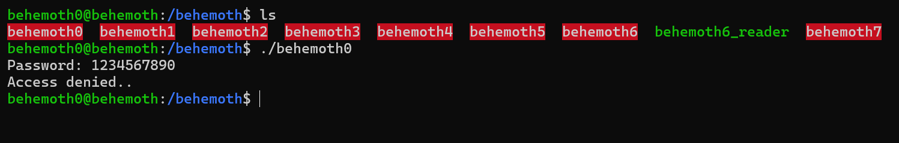

# Behemoth Level - 0

This is an elaborate each level oriented write-up for the Narnia wargame from OverTheWire.org. These challenges provide invaluable hands-on learning experiences in cybersecurity and exploitation techniques. If you find these resources helpful, please consider supporting the OverTheWire team who create and maintain these educational platforms—they're doing important work making security education accessible to everyone.

**`Donate at:`** [https://overthewire.org/information/donate.html](https://overthewire.org/information/donate.html)

---

**`Author:`** Jinay Shah

**`Tools Used:`**

- ltrace

---

# TL;DR

**Vulnerability Type:**

Hardcoded plaintext password comparison

**What’s happening:**

The binary directly compares user input against a hardcoded string **without any hashing or obfuscation**.

**Approach:**

- Use `ltrace` to observe library calls at runtime
- Identify the `strcmp()` comparison
- Extract the hardcoded password directly from the trace

**Key Observation:**

The program compares input to the string:

```
eatmyshorts
```

**Why this works:**

- No encryption or hashing is used
- Password is embedded in plaintext within the binary
- `ltrace` exposes arguments passed to `strcmp()`

**Result:**

Using `eatmyshorts` as the password grants access to the next level.

**Takeaway:**

This level demonstrates a **real-world bad practice**:

- Storing secrets in plaintext inside binaries
- Relying on direct string comparison for authentication

It’s trivial to break and intentionally so — the real Behemoth challenge starts from Level 1 onward.

---

## Level info:

### Don’t let behemoth get the better of you.

Behemoth is a wargame that has been rescued from the demise of **intruded.net**, previously hosted on behemoth.intruded.net. **Big thanks to adc, morla and reth** for their help in resurrecting this game!

What follows below is the original description of behemoth, copied from intruded.net:

`Summary:`

Difficulty:     3/10
Levels:         9
Platform:   Linux/x86

`Author:`
Anders Tonfeldt

Special Thanks:

Description:
This wargame deals with a lot of regular vulnerabilities found commonly 'out 
in the wild'. While the game makes no attempts at emulating a real environment
it will teach you how to exploit several of the most common coding mistakes 
including buffer overflows, race conditions and privilege escalation.

Behemoth’s levels are called **behemoth0, behemoth1, … etc.** and can be accessed on **behemoth.labs.overthewire.org** through SSH on port 2221.

To login to the first level use:

`Username: behemoth0
Password: behemoth0`

Data for the levels can be found in **/behemoth/**.

---

## Solution:



Well it is demanding a password that we certainly do not have.

Let’s try **`ltrace`** on behemoth0:


This one is pretty simple, the program directly compares without encryption the password string to “**`eatmyshorts`**” so that must be the password, let’s try that:


And there we go, pretty easy and simple. 
The challenge must begin from the next level onwards.

---
