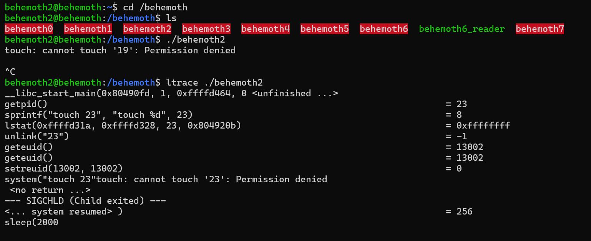
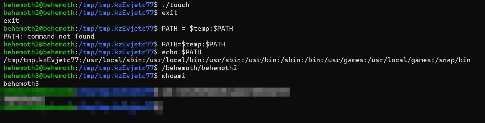

# Behemoth Level - 2

This is an elaborate each level oriented write-up for the Narnia wargame from OverTheWire.org. These challenges provide invaluable hands-on learning experiences in cybersecurity and exploitation techniques. If you find these resources helpful, please consider supporting the OverTheWire team who create and maintain these educational platforms—they're doing important work making security education accessible to everyone.

**`Donate at:`** [https://overthewire.org/information/donate.html](https://overthewire.org/information/donate.html)

---

**`Author:`** Jinay Shah

**`Tools Used:`**

- ltrace

---

# TL;DR

**Vulnerability Class**

PATH Hijacking / Command Execution via Environment Manipulation

**Core Idea**

The binary executes an external command (`touch`) without using an absolute path.

Because of this, it blindly trusts the user-controlled `$PATH` environment variable.

This allows us to inject our own malicious `touch` binary earlier in `$PATH`, which gets executed instead of `/usr/bin/touch`.

**What the Program Does**

- Calls `sleep(2000)` (intentional delay / distraction)
- Executes `touch <filename>` internally
- Assumes `touch` resolves safely via `$PATH`
- Runs with elevated privileges

**Exploitation Strategy**

1. Create a writable temp directory
2. Place a fake `touch` binary inside it (actually `/bin/bash`)
3. Give it executable permissions
4. Prepend the temp directory to `$PATH`
5. Execute the Behemoth binary
6. The program resolves your `touch` first
7. Privileged shell is spawned → password is exposed

**What Finally Mattered:**

- Understanding how `$PATH` resolution works
- Knowing commands are searched **left-to-right** in `$PATH`
- Placing malicious binary **before** `/usr/bin`
- Recognizing this as *environment abuse*, not exploitation via memory

**What did NOT matter:**

- Overthinking the `sleep(2000)` delay
- Focusing on file contents instead of execution flow
- Treating this like memory corruption

**Outcome**

Successful privilege escalation by hijacking command execution through `$PATH`.

Level cleared by exploiting **trust in environment variables**, not code complexity.

---

## Level info:

There is no information for this level, intentionally. 

[ It will remain so for all the next stages as well of this wargame series ]

---

## Solution:

Let’s begin with the usual normal execution of **`./behemoth2`** and with **`ltrace` :**



There is a sleep counter of 2000 seconds that’s why it was stuck- I was confuse for a second as in what happened there.

The touch command, simply creates empty file(s) with a filename. Let’s create a temp directory since we cannot directly create files in **`/behemoth`:**


We store the file path in temp variable so that we don’t have to remember the exact file path.

Next lets give **`rwx`** permissions to our temp directory and execute **`/behemoth/behemoth2`:**


The file is empty, as expected.

Now the exploit idea in this one seems to be that, we somehow change/replace the actual touch command with a touch command that we customize in essence- it will make sense in a while.

Let’s figure out some basics first:


So I checked for the available shells, then where the touch command is located exactly, which is: **`/usr/bin/touch`** then,
I create a touch file with location to → **`/bin/bash`** give it **`rwx`** permissions with **`chmod 777`.** 
And the same is reflected with exit command.

Also, look at the **`$PATH`** variable:


The thing is it will iterate in order only so we need to have our touch file before very other file in order to not actually replace the touch command, but instead execute ours because it is iterated over first then after the actual touch command in **`/usr/bin` .**

So all that remains now is to replace the actual touch with [in order not literally], we can do that by:

```
PATH=$temp:$PATH
```

Path to our temp directory:


Now let’s try executing **`/behemoth/behemoth`**, and it works:



Password revealed. Level cleared.

---
