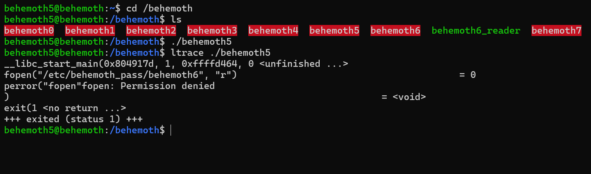

# Behemoth Level - 5

This is an elaborate each level oriented write-up for the Narnia wargame from OverTheWire.org. These challenges provide invaluable hands-on learning experiences in cybersecurity and exploitation techniques. If you find these resources helpful, please consider supporting the OverTheWire team who create and maintain these educational platforms—they're doing important work making security education accessible to everyone.

**`Donate at:`** [https://overthewire.org/information/donate.html](https://overthewire.org/information/donate.html)

---

**`Author:`** Jinay Shah

**`Tools Used:`**

- ltrace
- gdb

---

# TL;DR

**Vulnerability Class:**

**Insecure data exfiltration via local network socket (logic flaw / information disclosure)**

The binary reads a privileged file and **transmits its contents over an unauthenticated local TCP socket** without encryption or access control.

**Core Concept:**

**Privileged file read + plaintext network transmission = passive credential disclosure**

Instead of preventing access, the program:

- successfully reads `/etc/behemoth_pass/behemoth6`
- then sends the contents to `localhost` over a predictable port
- assuming no attacker is listening

**Methodology:**

1. **Static & Dynamic Analysis**
    - Disassembled `main()` in GDB
    - Identified `fopen()` reading `/etc/behemoth_pass/behemoth6`
    - Traced file handling (`fseek`, `ftell`, `rewind`, `malloc`, `fgets`)
    - Observed network-related libc calls:
        - `gethostbyname()`
        - `socket()`
        - `htons()`
        - `sendto()`
2. **Network Behavior Identification**
    - Resolved target host: `localhost`
    - Extracted hardcoded port value (via `atoi` + `htons`)
    - Confirmed TCP socket usage
    - Determined plaintext transmission (no encoding / encryption)
3. **Exploit Strategy**
    - Let the binary run normally (no need to interfere with file access)
    - Passively listen on the target port
    - Capture the password as it is transmitted over the loopback interface

**Final Working Payload:**

**Terminal 1 — Listener**

```bash
nc -lvnp 1337
```

**Terminal 2 — Execute binary**

```bash
./behemoth5
```

**Result:**

The password for `behemoth6` is received directly via the listening socket.

---

## Level info:

There is no information for this level, intentionally. 

[ It will remain so for all the next stages as well of this wargame series ]

---

## Solution:

Let’s begin with normal execution of our **`./behemoth5`** script and then we will see as to how it behaves:



The program tries to read the contents of **`/etc/behemoth_pass/behemoth6`** [which we want to access as well] but since the file: **`/etc/behemoth_pass/behemoth6`** require behemoth6 permissions to read, the program fails to read it and quits with exit code 1.

Let’s analyze the same in gdb and disassemble the main function:

```
gdb behemoth5
(gdb) disassemble main
```


Quite a large main function, in fact if I’m not wrong largest disassembling eve in all the OverTheWire series I have attempted so far.

Here’ the interesting bit at our disposal though:


```
0x08049294 <+46>:    push   $0x804a008
0x08049299 <+51>:    push   $0x804a00a
0x0804929e <+56>:    call   0x80490e0 <fopen@plt>
```

So this **`fopen`** function definitely accesses the behemoth6 file, let’s see what the two registers **`0x804a008`** and **`0x804a00a`** store values as:


So; 

**`0x804a00a`** → stores the behemoth6 password file

**`0x804a008`** → “r” is the read permission 

Alright, the program is quite lengthy, I will look up everything I don't understand clearly and also establish talking point for the one’s equally lost and overwhelmed as me:


**`<perror@plt>`** is for error generation it prints: **`s: <human-readable error message>`** based on the current value of **`errno`**.

And if the error exists it exits: **`<exit@plt>`**

Next, this:


If the program can read the file it gets the file contents using **`<fseek@plt>`** and writes it using **`<ftell@plt>`** 

 Next this one:


I don’t know what is **`<rewind@plt>`**, let’s see if we can read it:


That does not make a lot of sense now does it?

Okay so here’s what it does:

- Sets the file position indicator to the **beginning of the file**
- Clears the error and EOF flags for that stream

Equivalent to:

```c
fseek(stream,0, SEEK_SET);
clearerr(stream);
```

**`<malloc@plt>`** must be storing the values.

**`<fgets@plt>`** must be used for standard input i.e. the behemoth6 password file.

**`<strlen@plt>`** is used to get the length of string, pretty basic.

Next:


This one is quite interesting than before:

**`<fclose@plt>`** simply quits or closes the file i.e. behemoth6.

**`<gethostbyname@plt>`** I genuinely don’t know what this is either, let’s look it up:


This is not readable as well, okay so here’s the misconception I had- we can only read registers with push instruction not **`call`**, not **`jmp`** not **`mov`** no other only **`push`** let’s see some register before or after this:


So **`localhost`** is being used, I don’t know why, but it is being used- so there must be some network related activity carried out by the program, here’s what **`<gethostbyname@plt>`** does:

- Takes a hostname (e.g. `"example.com"`)
- Resolves it to IP address(es)
- Returns a `struct hostent *`

Example:

```c
structhostent *h = gethostbyname("google.com");
```

Notes:

- Uses **DNS / `/etc/hosts`**
- **Not thread-safe**

I think it might be sending the contents of behemoth6 password file to the localhost, because the next interesting function executed is:

**`<socket@plt>`** 


`socket()` is a libc function that creates a network socket:

```c
intsocket(int domain,int type,int protocol);
```

examples:

```c
socket(AF_INET, SOCK_STREAM,0);// TCP
socket(AF_INET, SOCK_DGRAM,0);// UDP
```

It returns:

- A file descriptor (>= 0) on success
- `1` on failure (sets `errno`)

Next we got something interesting looking although I don’t know what it exactly is:


What is `atoi`

`atoi()` = **ASCII to integer**

```c
intatoi(constchar *nptr);
```

It converts a string to an `int`.

Example:

```c
int port = atoi("8080");// port = 8080
```

Important properties:

- **No error checking**
- Stops at first non-digit
- Returns `0` on failure (ambiguous)

In real binaries, it’s often used for:

- Command-line args
- Config values
- User-supplied ports / sizes

`htons()` = **Host TO Network Short**

```c
uint16_thtons(uint16_t hostshort);
```

What it does:

- Converts a 16-bit value from **host byte order** → **network byte order**
- Network byte order = **big-endian**

Example:

```c
uint16_t port = htons(8080);
```

On little-endian systems:

```
0x1F90 (8080) →0x901F
```

So this tells us that there for sure is some network activity happening the background of this process, and it definitely involves behemoth6 password file being shared/transported.

Let’s actually see what this memory pushed before **`atoi@plt` :**


I don't know what this number is, allow me to refer to some walkthroughs or writeups and I can make sense of it, although it should be something of relevance and use.

Okay so this is the port number at which transmission takes place, pretty neat. Now we can make sense of this, so the program utilizes localhost at port 1337.

And that brings us to this really close one to our intentions:


**`0x2c`** or **`0x2`**4probably might be the password of behemoth 6 as the contents of behemoth6 file being transported; although that is an assumption i have based on **`<sendto@plt>`** function, I'm not too sure about it either.

Okay now it is making sense more than ever, we might be able to exploit this while its in network and read the contents of the file being transmitted- because there certainly doesn't seem to be any encryption methodology put to use here.

We will need two terminals one executing the program the other listening on port 1337:


And there we go, it executed as thought around. The password for behemoth 6 is grabbed.

Onto next one.

---

## References:

1. YouTube [HMCyberAcademy]:
    
    [https://www.youtube.com/watch?v=H6JTwwKHkvE](https://www.youtube.com/watch?v=H6JTwwKHkvE&t=3520s)
    

---
