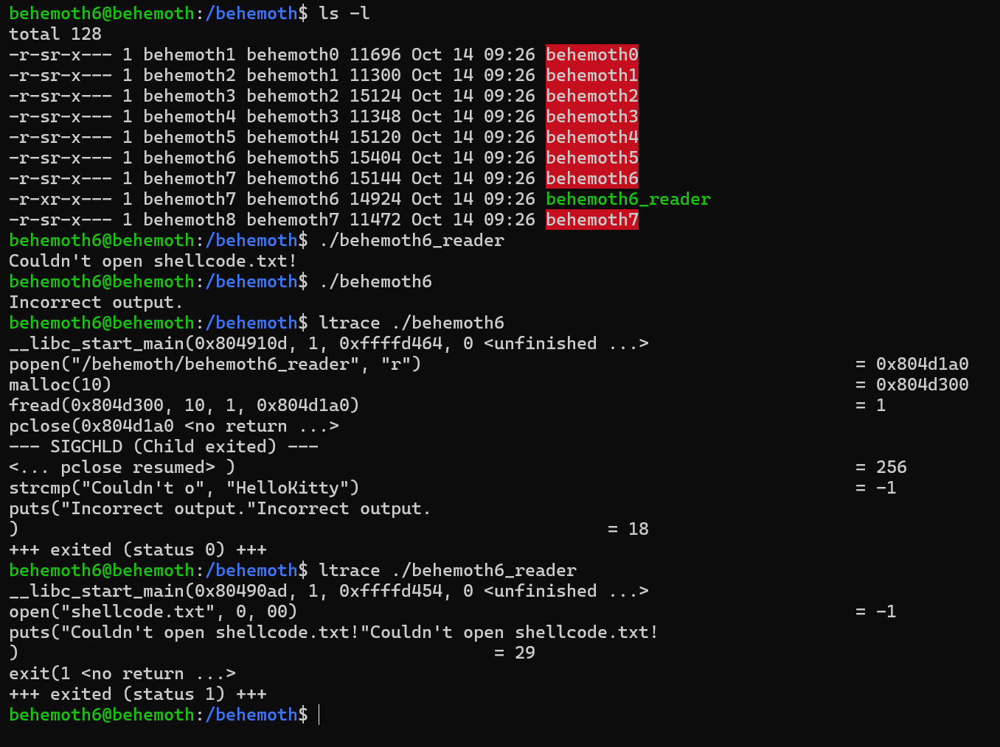
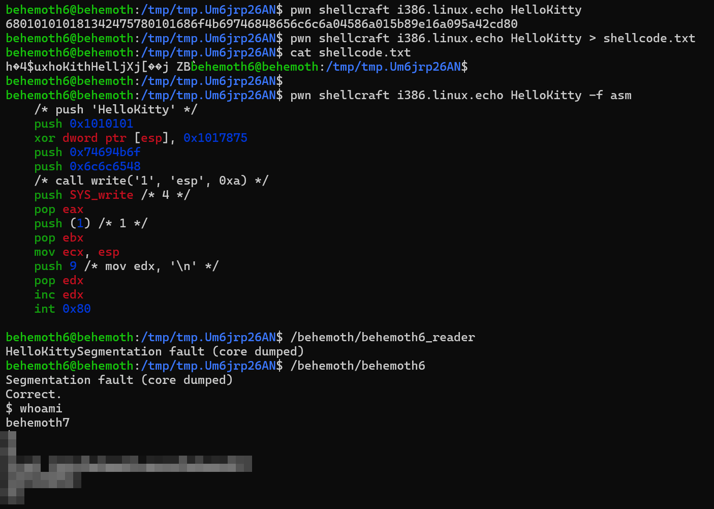

# Behemoth Level - 6

This is an elaborate each level oriented write-up for the Narnia wargame from OverTheWire.org. These challenges provide invaluable hands-on learning experiences in cybersecurity and exploitation techniques. If you find these resources helpful, please consider supporting the OverTheWire team who create and maintain these educational platforms—they're doing important work making security education accessible to everyone.

**`Donate at:`** [https://overthewire.org/information/donate.html](https://overthewire.org/information/donate.html)

---

**`Author:`** Jinay Shah

**`Tools Used:`**

- ltrace
- pwn shellcraft

---

# TL;DR

**Vulnerability Class:**

Unsafe execution of attacker-controlled shellcode via logic flaw in inter-process string comparison

The parent binary (**`behemoth6`**) executes a helper program (**`behemoth6_reader`**) and compares only the first 10 bytes of its output against the hardcoded string **`"HelloKitty"`**.

**Core Concept:**

Controlled code execution gated by string equality

If the helper process outputs exactly **`"HelloKitty"`** (length-limited comparison), the parent program spawns a privileged shell.

The challenge is not memory corruption — it is crafting shellcode whose execution results in a precise output string.

**Methodology:**

1. Program Behavior Analysis
    - `behemoth6` executes `behemoth6_reader`
    - `behemoth6_reader` attempts to open `shellcode.txt`
    - If present, it executes the contents as shellcode
    - Output from this execution is captured by `behemoth6`
2. String Comparison Logic
    - Only the first 10 bytes of output are compared
    - Target string: `"HelloKitty"` (length = 10)
    - Any output mismatch → no shell
3. Exploit Strategy
    - Provide shellcode that prints `"HelloKitty"` to stdout
    - Store shellcode in `shellcode.txt`
    - Ensure shellcode runs correctly on the target environment
4. Critical Insight
    - Shellcode generated locally failed due to environment mismatch
    - Shellcode must be generated on the Behemoth server itself
    - Correct execution context mattered more than shellcode correctness

**Final Working Payload:**

Shellcode generated directly on the Behemoth server:

```bash
pwn shellcraft i386.linux.echo HelloKitty > shellcode.txt
```

Verification:

```bash
/behemoth/behemoth6_reader
```

**Result:**

The output matches **`"HelloKitty"`** → privileged shell is spawned.

**Learnings:**

- Logic flaws can fully replace memory corruption
- Partial string comparisons are dangerous
- Executing attacker-controlled code doesn’t always mean “spawn a shell”
- **Execution context matters** — where shellcode is built can determine success
- Tools can generate shellcode, but understanding *what it does* is non-negotiable

> Behemoth Level-6 teaches that control over behavior is often more powerful than control over memory.
> 

**What Finally Mattered:**

Not writing “better” shellcode —

but understanding what output the program was checking for and why.

---

## Level info:

There is no information for this level, intentionally. 

[ It will remain so for all the next stages as well of this wargame series ]

---

## Solution:

There are two files supposedly this time around for level - 6, let’s look at their execution:



Pretty interesting, so when we execute **`./behemoth6`:** 
It opens **`/behemoth/behemoth6_reader`** file with read [r] permissions, reads it’s as a child process and then the contents of it are compare it with “HelloKitty”.
Now the string it compares to is the output of **`./behemoth6_reader`** which tries to open the file **`shellcode.txt` w**hen it could not do so, it return the string:

*Couldn't open shellcode.txt!*

Only the string length of **`*HelloKitty*`** i.e. 10 characters is compared to that of the returning string of ./behemoth6_reader which is **`*Couldn't o`**.*

Okay so we understand the working of the program behavior entirely, and I have got a gist of how to manipulate the same in our favor.

We will need a SHELLCODE, I will be using the one that I have been using for a while now, if you have been following my write-ups or walkthroughs enough, you must know by now:

Link to the page:

```
https://shell-storm.org/shellcode/files/shellcode-606.html
```

Shell-hex code:

```
\x6a\x0b\x58\x99\x52\x66\x68\x2d\x70\x89\xe1\x52\x6a\x68\x68\x2f\x62\x61\x73\x68\x2f\x62\x69\x6e\x89\xe3\x52\x51\x53\x89\xe1\xcd\x80
```


You can choose any other SHELLCODE as well, however ensure that is preserves effective user ID as in: **`bash -p`.**


This created a segmentation fault, I need to use it with echo -e instead:


See it asks us to write our own shell code or “HelloKitty”, get it?

Okay if you don’t- when we execute  **`behemoth6`** it compares the string to “HelloKitty”, and when we created a shellcode.txt file, behemoth6_reader gives another output which is not the same as “HelloKitty” in either case, so what can we do? If we craft a shellcode that returns the value “HelloKitty” store it in **`shellcode.txt`** which when executed by **`behemoth6_reader`** file returns the same value, **`behemoth6`** file would spawn the shell!

Let’s try building one with python:

```
b'h\x01\x01\x01\x01\x814$ux\x01\x01hoKithHellj\x04Xj\x01[\x89\xe1j\tZB\xcd\x80'
```

This is not working, let’s try one with pwn shellcraft:

```
680101010181342475780101686f4b69746848656c6c6a04586a015b89e16a095a42cd80
```

Nope, not working either.

There must be some reason as to why this is not working, since the shell code has no error- since it is made using tools, I even tried building one manually but it was tedious and not well curated. After this series I am going to dedicate some time on learning that particular bit of skill- on how to develop a shell code and learning its craft.

Okay so I used some resources and apparently it has to be created and stored in the behemoth server terminal itself or otherwise it will not work, let’s attempt that, let’s first check if we got the tools on behemoth server or not:


we will use: **`i386.linux.echo`**

```
pwn shellcraft i386.linux.echo HelloKitty > shellcode.txt
```


Okay so it looks similar to the ones we have generated previously, let’s see if it works this time around though.

If we wish to inspect the assembly instructions for the same command, we can using:

```
pwn shellcraft i386.linux.echo HelloKitty -f asm
```


Here, we go. Let’s try reading **`/behemoth/behemoth6_reader`** again:




And there we go it works finally. 
So sometimes the key is to use tools as and when and especially the **WHERE** to use it.

Onto the last one now, Behemoth-7 awaits.

---

## References:

1. YouTube [HMCyberAcademy]:
    
    [https://www.youtube.com/watch?v=H6JTwwKHkvE](https://www.youtube.com/watch?v=H6JTwwKHkvE&t=3520s)
    

---
